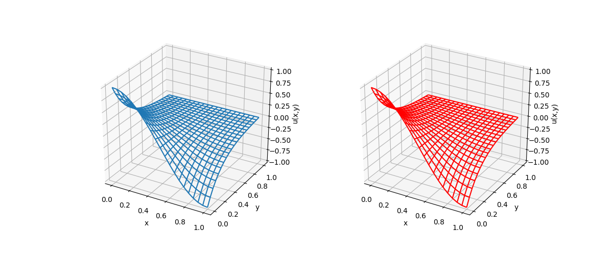

# Poisson Equation 2D

[Link to Chai & Shi paper](https://www.sciencedirect.com/science/article/pii/S0307904X07001722?via%3Dihub)
"A novel lattice Boltzmann model for the Poisson equation"

**Left is Analytic, Right is LBM**

--- 

We can solve the homogeneous Helmholtz equation with the modified BGK model
for Poisson's equation. The helmholtz equation is:

$$\frac{\partial^2u}{\partial x^2} + \frac{\partial^2u}{\partial y^2} = \lambda^2u $$

Boundary conditions:

$$u(0,y) = \frac{sinh(\mu(1-y))}{sinh(\mu)}$$
$$u(1,y) = -\frac{sinh(\mu(1-y))}{sinh(\mu)}$$
$$u(x,0) = cos(\pi x)$$
$$u(x,1) = 0$$

Where:

$$\mu = \sqrt{\lambda^2+pi^2}$$

$\lambda$ is set to 2. The analytic solution of this problem is:

$$u(x,y) = cos(\pi x) \frac{sinh(\mu(1-y))}{sinh(\mu)}$$

---

The modified BGK proposed by model is:

$$f_i(x+c_i\Delta t,t+\Delta t) - f_i(x,t) = \Omega_i + \Omega_i'$$

Where:

$$\Omega_i = -\frac{1}{\tau} [f_i(x,t)-f_i^{eq}(x,t)]$$

and

$$\Omega_i' = \Delta t \bar \omega_iRD$$

Where $R$ is the right hand term of the Poisson equation and equals zero in the Laplace equation

the equilibirium distribution function ($f_i^{eq}$) is defined by:

$$
f_i^{eq} = 
\begin{cases}
k_0\ u(x,y),\ \ \  i = 0\\
(1-k_0)/4\ u(x,y),\ \ \ \ \ \ \ \ \ \ \ \ \ \ i = 1-q\\
\end{cases}
$$

For the D2Q5 Lattice the lattice weights are:

$$
\begin{cases}
\omega_0 = 0\\
\omega_i = 1/4 (i = 1-4)
\end{cases}
$$